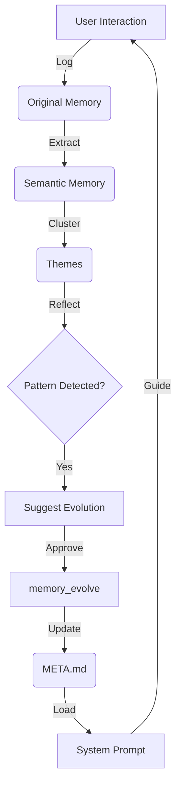

# OpenClaw Adaptive Memory Core (OAMC) Architecture

## 📖 Overview

The OAMC architecture fuses hierarchical storage (**xMemory**), semantic classification (**Taxonomy**), and self-evolutionary loops (**AMemGym**) into a unified system for autonomous agents.

It addresses the "Static Agent" problem by allowing the agent to dynamically rewrite its own instruction set (`META.md`) based on experience, effectively "learning" from interactions without needing model fine-tuning.

## 🏗️ Core Pillars

### 1. Dual-Stream Persistence (双流存储)

Combines human auditability with machine performance.

| Stream | Component | Path | Format | Purpose |
|--------|-----------|------|--------|---------|
| **A. Canonical** | **Originals** | `memory/YYYY-MM-DD.md` | Markdown | Narrative logs, human review, Git diffs. |
| | **Evolution** | `memory/META.md` | Markdown | Self-generated rules, SOPs, prompt overrides. |
| **B. Derived** | **Index** | `.memory/index.json` | JSON | Fast ID->Path lookup. |
| | **Themes** | `.memory/themes/*.json` | JSON | High-level clustered concepts. |
| | **Semantics** | `.memory/semantics/*.json` | JSON | Atomic facts. |

### 2. The Cognitive Loop (认知循环)

A continuous cycle of Retain -> Reflect -> Evolve.

1.  **Ingest (Retain)**:
    *   User input is stored as an **Original** log.
    *   Immediate context is cached as **Episodes**.
    *   Atomic facts are extracted as **Semantics**.

2.  **Reflect (Mining)**:
    *   `memory_reflect` tool scans recent history.
    *   Identifies recurring patterns (e.g., "User repeatedly corrects SQL syntax").
    *   Groups related semantics into **Themes**.

3.  **Evolve (Adapt)**:
    *   If a Theme crosses a frequency threshold, `memory_reflect` suggests an evolution.
    *   `memory_evolve` writes a new rule to `META.md` (e.g., "Rule: Always use PostgreSQL syntax").
    *   **Next Session**: Agent loads `META.md` into System Prompt, effectively "learning" the new behavior.

### 3. Memory Taxonomy (记忆分类)

Data is tagged implicitly during the `remember` phase to aid retrieval.

*   **Factual**: "User name is Alice." (Semantic)
*   **Procedural**: "How to deploy to AWS." (SOP in `META.md`)
*   **Episodic**: "We discussed databases yesterday." (Episode)

## 🛠️ Toolchain

| Tool | Function | Target Layer |
|------|----------|--------------|
| `memory_remember` | Store facts/logs. | Original, Semantic |
| `memory_recall` | Retrieve context. | Theme, Semantic, Episode |
| `memory_reflect` | Mine patterns & suggest changes. | Theme -> Evolution Suggestion |
| `memory_evolve` | **New!** Write to `META.md`. | Evolution Layer (`META.md`) |

## 🔄 Self-Evolution Workflow

## 📚 References
- [AMemGym: Interactive Evaluation & Self-Evolution](https://mp.weixin.qq.com/s/F_MtadsdyXbA7eeMDkdn6w)
- [xMemory: Hierarchical Memory Architecture](https://arxiv.org/html/2602.02007v1)
